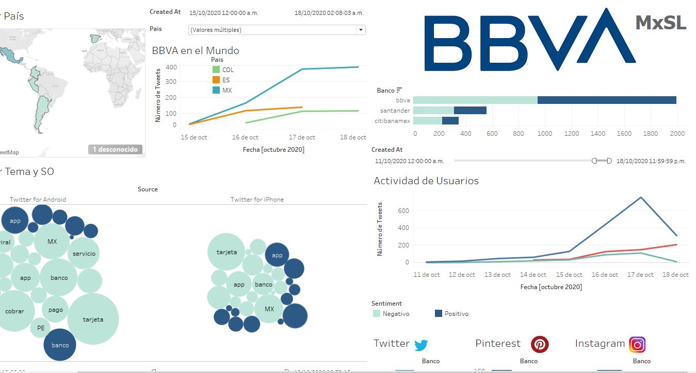

# Hackathon_BBVA_2020
Entrega Final Proyecto Hackathon BBVA 2020 Reto Social Listening

## Social Listening

Cardoso Olvera Edgar David

Garcés Mondragón Eduardo Arturo

Gómez Herrera María Andrea Liliana

Perrilliat García Ian

## Dashboard:
https://public.tableau.com/profile/edco17#!/vizhome/Compiladores_Hachathon2020_MxSL/Dashboard1?publish=yes

## Compiladores de Ciencia MxSL Tool Hackathon 2020 video:
https://www.youtube.com/watch?v=xXX6kMknGOE&feature=youtu.be

BBVA.xlsx es la base de datos principal con información de twitter.
Redes.xlsx es la base secundario de distintas redes sociales.
Data_Frame.py permite obtener y actualizar las bases de datos anteriores.

El modelo de red neuronal no se puede subir a github ya que pasa el tamaño permitido, lo que se puede hacer para obtener dicho modelo.

